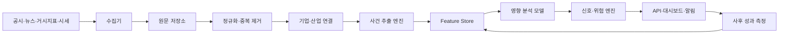

# 주식 변동 분석 시스템 설계안

## 1. 제품 정의

이 시스템의 1차 목적은 종목을 바로 추천하는 것이 아니라 다음 질문에 반복적으로 답하는 것이다.

1. 지금 어떤 사건이 발생했는가?
2. 어떤 기업과 산업에 노출되는가?
3. 매출, 비용, 할인율, 재무 위험 중 무엇을 바꾸는가?
4. 영향의 방향, 크기, 지속 기간, 신뢰도는 어느 정도인가?
5. 시장은 발표 직후와 이후에 실제로 어떻게 반응했는가?
6. 과거 유사 사건과 비교했을 때 현재 가격에 얼마나 반영되었는가?

첫 버전의 출력은 `매수/매도`보다 아래 형태가 적합하다.

```text
삼성전자 / 부정적 관찰
- 사건: 메모리 수출 규제 강화
- 영향 경로: 출하량 감소 -> 매출 감소 가능성
- 예상 기간: 1~2개 분기
- 신뢰도: 0.71
- 이미 반영된 정도: 중간
- 확인할 후속 지표: 수출액, DRAM 가격, 회사 가이던스
```

## 2. 핵심 설계 원칙

### LLM과 수치 모델의 역할을 분리한다

- LLM: 문서 요약, 종목 연결, 사건 분류, 영향 경로와 근거 추출
- 수치 모델: 예상 수익률, 변동성, 이상 수익률, 신뢰구간 계산
- 규칙 엔진: 출처 신뢰도, 중복 뉴스, 데이터 누락, 위험 제한 처리

LLM이 뉴스 원문을 보고 곧바로 매수 또는 매도를 결정하게 만들면 설명 가능성과 재현성이 크게 떨어진다.

### 시점 정보를 절대 잃지 않는다

모든 데이터에 최소 세 시각을 저장한다.

- `occurred_at`: 사건이 실제 발생한 시각
- `published_at`: 출처가 공개한 시각
- `first_seen_at`: 시스템이 처음 수집한 시각

백테스트에서는 당시 알 수 있었던 데이터만 사용해야 한다. 수정된 경제지표, 뒤늦게 수정된 기사, 상장폐지 종목을 현재 기준으로 사용하면 결과가 과대평가된다.

### 모든 결론에 근거를 남긴다

- 원문 URL과 출처
- 근거 문장 또는 공시 항목
- 사용한 모델과 버전
- 분석 시각
- 입력 데이터 버전
- 예측값과 실제 결과

## 3. 전체 구조



### 수집 계층

- 가격: 일봉, 거래량, 시가총액, 수정주가, 기업행동
- 기업: 공시, 재무제표, 실적 발표, 가이던스, 지분 변동
- 거시경제: 금리, CPI, 고용, 환율, 원자재, 경제 일정
- 텍스트: 기업 보도자료, 정부 발표, 신뢰 가능한 뉴스
- 시장 수급: 외국인·기관 매매, 공매도, 옵션 및 변동성 지표

원문은 수정하지 않고 객체 저장소에 보존하고, 파싱 결과만 별도 테이블에 저장한다.

### 사건 추출 계층

사건 분류 예시는 다음과 같다.

- `earnings`, `guidance`, `product_launch`, `contract`
- `regulation`, `tariff`, `tax`, `sanction`, `election`
- `war`, `geopolitical_risk`, `supply_disruption`
- `merger`, `buyback`, `dividend`, `capital_raise`
- `clinical_trial`, `approval`, `recall`, `accident`, `lawsuit`
- `rate_decision`, `inflation`, `employment`, `fx_shock`

사건은 단순 감성 점수가 아니라 다음 구조로 저장한다.

```json
{
  "event_type": "product_launch",
  "entities": ["AAPL"],
  "industries": ["smartphone", "semiconductor"],
  "channels": ["revenue", "margin", "competition"],
  "direction": "positive",
  "horizon_days": 90,
  "surprise_score": 0.76,
  "novelty_score": 0.83,
  "source_reliability": 0.95,
  "confidence": 0.78,
  "evidence": ["source-document-reference"]
}
```

### 영향 분석 계층

개별 사건 점수는 다음 개념으로 계산한다.

```text
event_score =
    direction
  * surprise
  * source_reliability
  * company_exposure
  * expected_persistence
  * model_confidence
  - priced_in_penalty
```

최종 종목 점수는 서로 다른 신호를 분리해서 보여준다.

```text
total_score =
    fundamental_score
  + event_score
  + macro_score
  + price_momentum_score
  + flow_score
  - risk_penalty
```

점수 하나만 노출하지 말고 구성 요소, 예상 기간, 신뢰구간을 함께 제공해야 한다.

## 4. 데이터 모델

최소 테이블은 다음과 같다.

| 테이블 | 용도 |
|---|---|
| `instruments` | 종목, 거래소, 산업, 상장 및 상장폐지 이력 |
| `entity_aliases` | 회사명, 브랜드명, 티커, 자회사 별칭 |
| `prices` | 수정 전·후 OHLCV와 기업행동 |
| `documents` | 수집한 원문과 출처, 세 시각, 해시 |
| `document_entities` | 문서와 기업 간 연결 및 확률 |
| `events` | 구조화한 사건과 영향 속성 |
| `event_impacts` | 사건별 종목·산업 영향 점수 |
| `fundamentals` | 재무 수치와 공시 당시 이용 가능 시각 |
| `macro_observations` | 발표값, 예상값, 이전값, 수정 이력 |
| `features` | 모델 입력값과 계산 시점 |
| `signals` | 모델별 예측, 기간, 신뢰도, 버전 |
| `outcomes` | 1일·5일·20일·60일 실제 성과 |
| `model_runs` | 학습 기간, 파라미터, 데이터 버전 |

## 5. 권장 기술 스택

- 언어: Python 3.12
- API: FastAPI
- 배치 및 워크플로: Prefect
- 데이터 처리: Polars, DuckDB
- 운영 DB: PostgreSQL
- 시계열 확장이 필요하면 TimescaleDB
- 원문 저장: S3 호환 객체 저장소
- 모델 관리: MLflow
- 대시보드: Next.js 또는 초기에는 Streamlit
- 배포: Docker Compose로 시작하고 규모가 커진 뒤 Kubernetes 검토

초기에는 Kafka, Kubernetes, 복잡한 마이크로서비스를 사용하지 않는다. 수집기와 분석 작업을 독립 모듈로 만들되 하나의 저장소와 배포 단위로 운영하는 편이 빠르다.

## 6. MVP 범위

권장 첫 범위는 다음과 같다.

- 시장: 한국 또는 미국 한 곳
- 대상: 유동성 높은 50~100개 종목
- 빈도: 장 마감 후 일 1회, 공시는 5~15분 주기
- 데이터: 가격, 기업행동, 공시, 재무제표, 주요 거시지표
- 사건: 실적, 가이던스, 계약, 증자, 자사주, 규제, 제품 발표
- 출력: 사건 타임라인, 영향 점수, 유사 과거 사건, 사후 수익률
- 제외: 초단타, 자동 주문, SNS 전체 크롤링, 틱 데이터

뉴스 전체를 먼저 모으기보다 공식 공시와 경제지표로 데이터 파이프라인을 검증한 뒤 뉴스 범위를 넓히는 것이 좋다.

## 7. 개발 순서

### 1단계: 데이터 기반

- 종목 마스터와 상장 이력 구축
- 가격과 기업행동 수집
- 원문 저장, 중복 제거, 재시도, 수집 상태 모니터링
- 데이터 품질 검사

완료 기준: 임의 날짜의 종목과 당시 이용 가능 데이터가 재현된다.

### 2단계: 사건 엔진

- 공시와 문서에서 기업 연결
- 사건 유형, 방향, 영향 경로, 기간 추출
- 동일 사건을 보도한 여러 문서 묶기
- 사람이 검토하고 수정할 수 있는 화면 제공

완료 기준: 핵심 사건 유형의 기업 연결 정확도와 분류 F1을 측정할 수 있다.

### 3단계: 영향 측정

- 시장·산업 수익률을 제거한 이상 수익률 계산
- 사건 후 1일, 5일, 20일, 60일 반응 저장
- 사건 유형별 평균 반응과 분산 계산
- 예상 대비 실제 발표치의 surprise feature 추가

완료 기준: 사건별 예측과 실제 결과가 자동으로 연결된다.

### 4단계: 신호와 검증

- 펀더멘털, 이벤트, 거시, 가격, 수급 모델을 분리
- 워크포워드 백테스트
- 거래비용, 슬리피지, 거래정지, 상장폐지 반영
- 모델별 기여도와 실패 사례 기록

완료 기준: 단순 벤치마크보다 개선되는지 표본 외 구간에서 확인한다.

### 5단계: 사용자 기능

- 종목별 사건 타임라인
- 변동 원인 후보와 근거
- 관심 종목 알림
- 시나리오별 상승·하락 요인
- 데이터와 모델 상태 대시보드
- 종목 검색 진입점 (티커·회사명·별칭으로 찾아 현 시스템 기반 상태 분석으로 진입)
- 급락 종목 스크리너 + 정직한 하락 진단 — 20일 고점 대비 낙폭이 큰 종목을 검증 사건이력과 대비해 `지속 악재 / 원인 미상(관찰) / 과잉반응(반등 후보)`으로 진단. 반등 후보는 mean-reversion 백테스트로 검증되기 전에는 매수 신호가 아닌 관찰로만 표기한다. (현 코퍼스에는 검증된 상승 신호가 없어 "오를 종목"을 직접 주장하지 않는다.)

## 8. 평가 지표

분류 정확도와 투자 성과를 따로 측정한다.

### 데이터·NLP 품질

- 수집 성공률과 지연 시간
- 중복 제거 정확도
- 기업 연결 precision/recall
- 사건 분류 macro F1
- 방향과 영향 기간의 calibration

### 금융 성과

- Information Coefficient
- 방향 적중률
- 시장·산업 조정 이상 수익률
- Sharpe ratio와 최대 낙폭
- turnover와 거래비용 차감 후 수익
- 신뢰도 구간별 실제 적중률

정확도보다 중요한 것은 `confidence=0.7`인 예측이 장기적으로 약 70% 수준의 신뢰성을 갖는지 여부다.

## 9. 반드시 피해야 할 오류

- 미래 데이터가 과거 학습에 섞이는 look-ahead bias
- 현재 살아남은 기업만 사용하는 survivorship bias
- 경제지표의 최신 수정값을 과거 발표값처럼 사용하는 오류
- 액면분할, 배당, 증자 등 기업행동 미반영
- 동일 기사를 여러 독립 신호로 계산하는 중복 문제
- 뉴스 감성을 가격 방향으로 바로 변환하는 방식
- 백테스트를 반복하며 테스트 구간까지 과적합하는 방식
- 무료 웹페이지 데이터를 서비스에서 무단 재배포하는 방식

## 10. 공식 데이터 출발점

- 한국 공시: [OpenDART](https://opendart.fss.or.kr/guide/main.do?apiGrpCd=DS001)
- 한국 시장 정보: [KRX Data Marketplace](https://data.krx.co.kr/contents/MDC/MAIN/main/index.cmd)
- 미국 공시·XBRL: [SEC EDGAR APIs](https://www.sec.gov/search-filings/edgar-application-programming-interfaces)
- 미국 거시경제: [FRED API](https://fred.stlouisfed.org/docs/api/fred/)

OpenDART는 공시 검색, 기업 개황, 원문 파일, 재무정보 API를 제공한다. SEC의 `data.sec.gov`는 인증키 없이 submissions와 XBRL JSON을 제공하며, 대량 수집에는 nightly bulk 파일 사용을 권장한다. FRED/ALFRED는 경제지표와 과거 발표 당시의 빈티지 데이터를 구분하는 데 유용하다.

KRX 데이터와 뉴스 콘텐츠는 조회 가능 여부와 별개로 복제·재배포 권한을 확인해야 한다. 외부 사용자에게 서비스할 계획이라면 시장 데이터 라이선스와 투자자문 관련 규제를 개발 초기에 검토해야 한다.

## 11. 첫 번째 구현 목표

가장 좋은 첫 번째 vertical slice는 아래 한 줄이다.

> 공시 한 건을 수집해 기업과 사건을 식별하고, 영향 가설을 저장한 뒤, 발표 후 1일·5일·20일 시장 조정 수익률을 자동 계산한다.

이 흐름이 제대로 작동하면 뉴스, 거시지표, 정치·전쟁 사건을 같은 사건 모델에 추가할 수 있다. 반대로 이 흐름이 검증되지 않은 상태에서 추천 모델부터 만들면 결과를 설명하거나 개선하기 어렵다.

